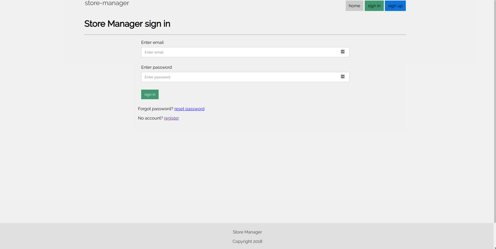

# Store-manager-UI

[](https://github.com/waracci/store-manager-ui/pulls)
> The user interface of store manager project

### View Application [Here](https://waracci.github.io/store-manager-ui/UI/html/index.html)

## Getting Started

These instructions will get you a copy of the project up and running on your local machine for development and testing purposes.

```
git clone https://github.com/waracci/store-manager-ui.git
open the index.html file in your browser
```
# App pages:

## Landing page

> contains the application description and links to sign in and sign up to access the apps features.


## Sign in page

> contains the application sign in page. This page leads to the dashboard




## Application dashboard

> contains the application dashboard that contains links to the apps features


## Products page

> All products in inventory are listed here


## Sales page

> All sales made by store attendants are listed here


## Authors

- **Morris Warachi** - _Initial work_ - [warachi](https://github.com/waracci)


## License

This project is licensed under the MIT License - see the [LICENSE.md](LICENSE.md) file for details

## Acknowledgments

- Inspiration
- coffee
